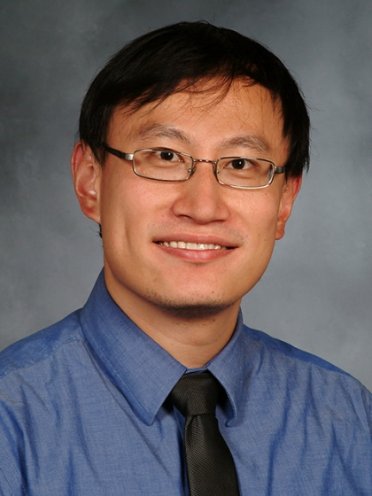
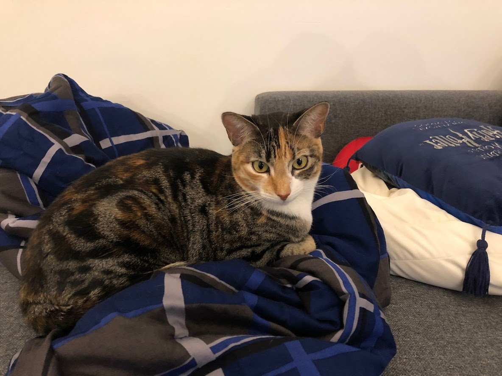

Master's Candidate/NLM Postdoctoral Fellow (uni: rc3179)

Department of Biomedical Informatics, Columbia University

Clinical Assistant Professor

Department of Medicine, Weill Cornell Medical College

{width=150px}

## About
Hi I'm Ray, welcome to my web site. I'm currently an NLM Postdoctoral Fellow pursuing an MA in Biomedical Informatics at Columbia University. I also work part-time as a Hospitalist at Weill Cornell Medical College/New York-Presbyterian. I received my BA in Computer Science from Duke University and my MD from Yale University School of Medicine. I completed Internal Medicine residency at UCSF and recently moved to NYC in 2017. You can feel free to check out my academic/professional experience and CV [here](cv.html) or in the links above.

And here is a picture of my cat Snuffer!

